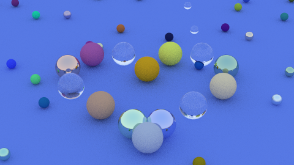

# Our Fork of Raytracing in One Weekend

In our fork, we changed the scene to make a beautiful heart shape with balls of varying materials. To make it look a bit more interesting, we kept the random, smaller balls from the original scene.

This is an image generated by our version of the code.



WARNING: Some of the balls may appear within each other. We could add a logic to prevent this, but it would add to much to the code without making the scene much different.

## Group

*   [Anderson Sassaki](https://github.com/wallksss)
*   [Giovanna Vieira](https://github.com/gihtheghost)
*   [Lorenzo Grippo](https://github.com/loren-gc)
*   [Ti Ribeiro](https://github.com/tiribsil)

## Fulfillment of Project Specifications

This section details how each requirement from the assignment was met.

✅ **1. Follow the Raytracing in One Weekend tutorial.**
> There is no way to prove we did this, but we did, you can trust us :)

✅ **2. Generate a scene containing a set of balls of each of the 3 materials. Change the parameters of the materials to generate a pretty scene.**
> The balls forming the heart cycle through each of the 3 materials using random parameters.

✅ **3. Change the camera's position and point of view.**
> We made the camera higher to see the heart shape from above, looking at the center of the heart.

✅ **4. Save your changes and your image in a GitHub fork.**
> We made the camera higher to see the heart shape from above, looking at the center of the heart.

Building and Running
---------------------
Copies of the source are provided for you to check your work and compare against. If you wish to
build the provided source, this project uses CMake. To build, go to the root of the project
directory and run the following commands to create the debug version of every executable:

    $ cmake -B build
    $ cmake --build build

You should run `cmake -B build` whenever you change your project `CMakeLists.txt` file (like when
adding a new source file).

You can specify the target with the `--target <program>` option, where the program may be
`inOneWeekend`, `theNextWeek`, `theRestOfYourLife`, or any of the demonstration programs. By default
(with no `--target` option), CMake will build all targets.

    $ cmake --build build --target inOneWeekend

And, to generate the image:

    $ build/inOneWeekend > output.ppm

This will generate an image called ```output.ppm```.

### Optimized Builds
CMake supports Release and Debug configurations. These require slightly different invocations
across Windows (MSVC) and Linux/macOS (using GCC or Clang). The following instructions will place
optimized binaries under `build/Release` and debug binaries (unoptimized and containing debug
symbols) under `build/Debug`:

On Windows:

```shell
$ cmake -B build
$ cmake --build build --config Release  # Create release binaries in `build\Release`
$ cmake --build build --config Debug    # Create debug binaries in `build\Debug`
```

On Linux / macOS:

```shell
# Configure and build release binaries under `build/Release`
$ cmake -B build/Release -DCMAKE_BUILD_TYPE=Release
$ cmake --build build/Release

# Configure and build debug binaries under `build/Debug`
$ cmake -B build/Debug -DCMAKE_BUILD_TYPE=Debug
$ cmake --build build/Debug
```

We recommend building and running the `Release` version (especially before the final render) for
the fastest results, unless you need the extra debug information provided by the (default) debug
build.
